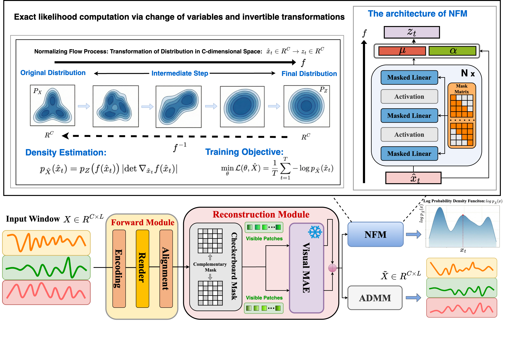
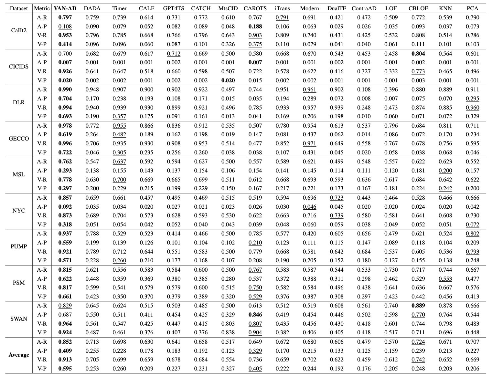

#  VAN-AD: Visual Masked Autoencoder with Normalizing Flow For Time Series Anomaly Detection

**Official PyTorch implementation of the paper: VAN-AD: Visual Masked Autoencoder with Normalizing Flow For Time Series Anomaly Detection.**

If **VAN-AD** helps your research, please consider giving us a ⭐ star!

[](https://www.python.org/)  [](https://pytorch.org/)

## 💡 Overview
**VAN-AD**, a novel MAE-based framework for TSAD. To alleviate the over-generalization issue of MAE, we design an **Adaptive Distribution Mapping Module (ADMM)**, which maps the reconstruction results before and after MAE into a unified statistical space to amplify discrepancies caused by abnormal patterns. To overcome the limitation of local perception, we further develop a **Normalizing Flow Module (NFM)**, which combines MAE with normalizing flow to estimate the probability density of the current window under the global distribution.
<div style="text-align: center;">
    
</div>


## 🚀 Getting Started

### Installation

Ensure you have a Python 3.8+ environment ready. Install the necessary dependencies via:

```
pip install -r requirements.txt
```

### Data preparation
Download MSL/PSM datasets via [OneDrive](https://drive.google.com/file/d/1fAbKk2keJpp2tavkJlbtr5xjG8wI7ekf/view) and store them under the /data path, for example: /data/PSM
Regarding the remaining datasets, we follow the TAB data processing pipeline. Download the dataset from TAB (https://github.com/decisionintelligence/TAB) and store it under the data folder, for example, data/tab.

### Train & Evaluation

- **Model Definition**: Explore the core logic in [here](./van-ad/vanad_model.py).
- **Reproduction**: Run the provided scripts to replicate our results. For instance, to test on the PSM dataset:

```shell
sh ./scripts/PSM.sh
```


## 📊 Experimental Results

Extensive experiments on nine real-world datasets demonstrate that VAN-AD achieves state-of-the-art performance. We show the main results of all the nine real-world datasets:

<div align="center">

</div>


<!-- ## 🛠️ Setup for Running Baseline Models
We also include scripts for baseline models (e.g., PatchTST-AT) for fair comparison:
```shell
sh ./scripts/multivariate_detection/detect_label/Genesis/PatchTST-AT.sh
```
## 🙏 Acknowledgements
We acknowledge the following open-source projects for their outstanding contributions to the field:

- TAB: Unified Benchmarking of Time Series Anomaly Detection Methods（https://github.com/decisionintelligence/TAB）
- CATCH: Channel-Aware Multivariate Time Series Anomaly Detection via Frequency Patching（https://github.com/decisionintelligence/CATCH） -->

<!-- ## 📝 Citation

<!-- If you find this repo useful, please cite our paper.

```
@inproceedings{chen2025redf,
  title     = {{RED-F}: Reconstruction-Elimination based Dual-stream Contrastive Forecasting for Multivariate Time Series Anomaly Prediction},
  author    = {Chen, P Y and Shi, X and Chang, Y and others},
  booktitle = {arXiv preprint arXiv:2511.20044},
  year      = {2025}
} -->


## ✉️ Contact

If you have any questions or suggestions, feel free to contact:
- [PengYu Chen]  (penychen@bupt.edu.cn)
- [Shang Wan]  (2025110739@bupt.cn)

- Or describe it in Issues.

